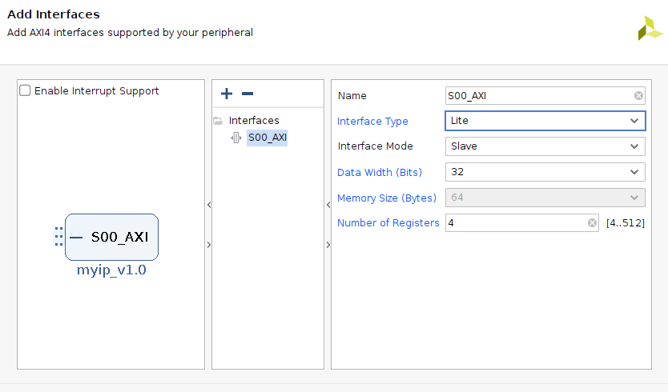
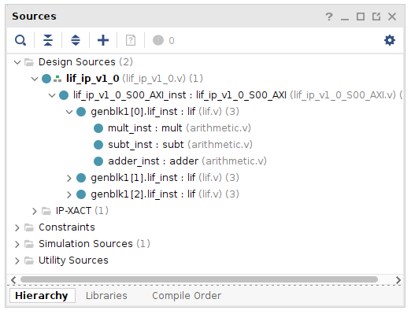
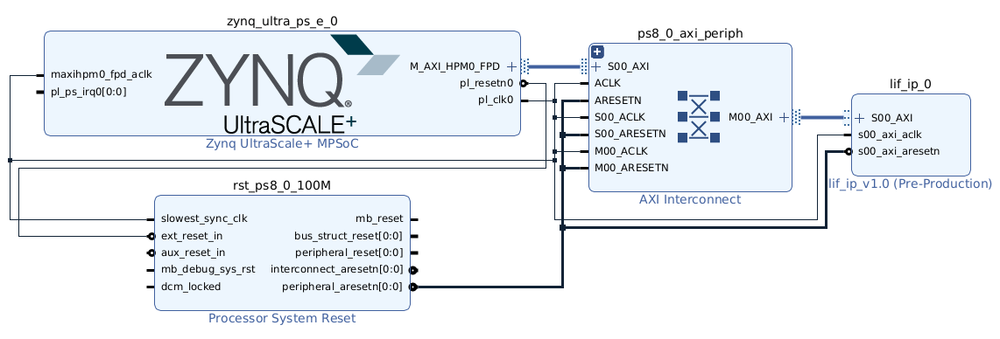

# Spiking Neural Network

This branch contains the IP for the LIF neuron, and jupyter notebooks to test the neuron with the Iris dataset.

Work in progress in the `develop` branch to implement a network on the FPGA fabric.

## Steps to replicate the project

1. Clone the repository

`network_py/data/weights.csv` contains the weights of the trained network. It is generated in the `my_network_iris_train.ipynb` notebook.

2. Run the `my_network_iris_eval.ipynb` notebook to test the network locally.

3. Create a new Vivado project and create a new AXI4-Lite Peripheral IP. 

4. Delete the existing files from the IP sources, and add the files from the `hdl` and `src` directories in `vivado_proj/ip_repo/lif_ip_1_0` in the repository as sources. 

5. Package this IP and add it to the block design of the original Vivado project. Instantiate a Zynq Processing System, and run block automation and connection automation.

6. Create HDL wrapper and generate bitstream. Export the bitstream and hardware handoff file (which can be found in the `gen/hw_handoff` folder in the project directory).

7. Import the bitstream and hardware handoff files into the PYNQ environment. Follow the `fpga/my_network.ipynb` notebook to test the network on the PYNQ board.